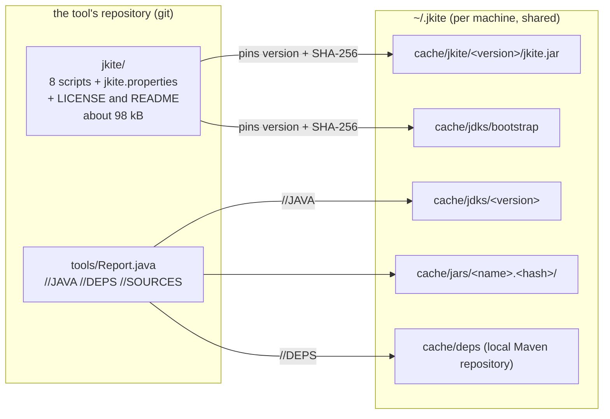
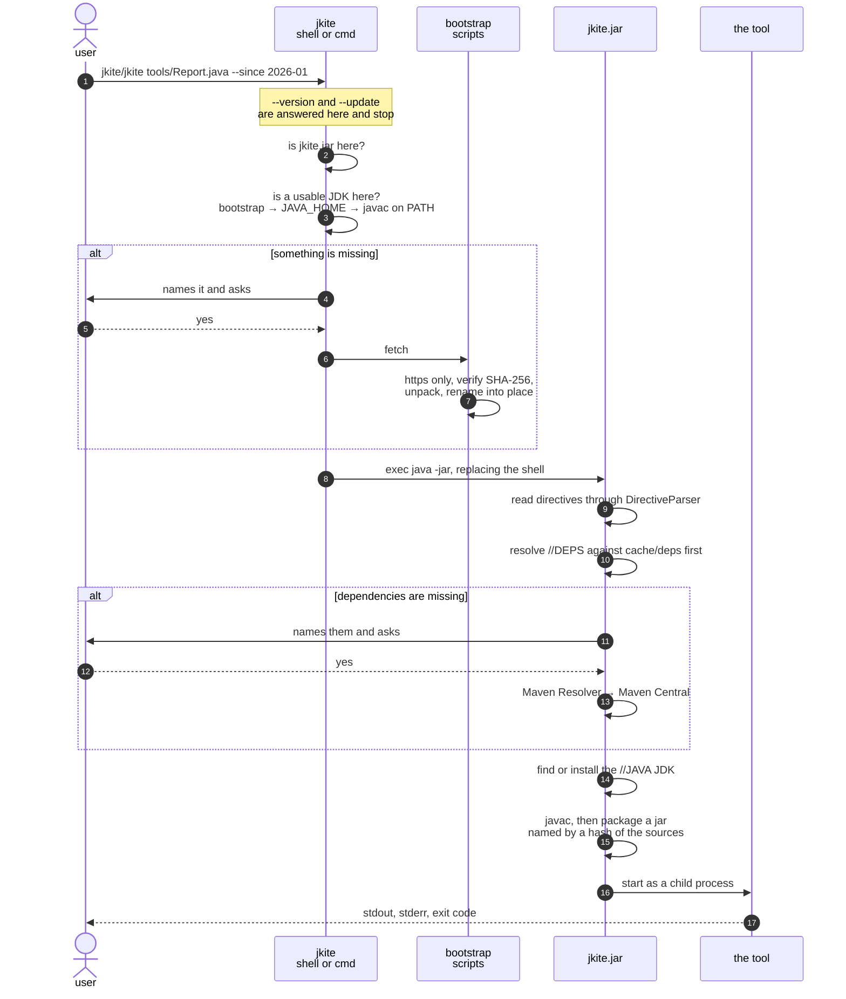
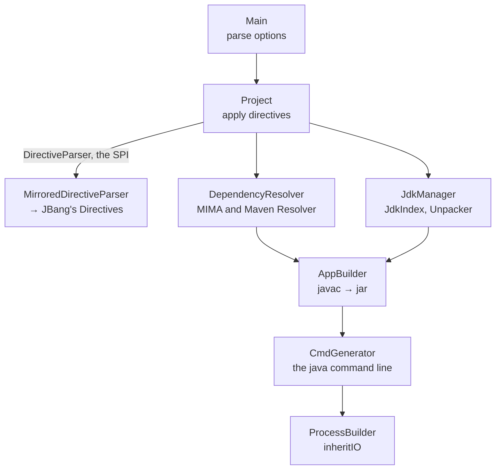

# How jkite works

Two programs, one boundary. A shell script finds a JDK and a jar; the jar
builds and runs the tool. Everything below is what happens between
`git clone` and the tool's first line of output.

## What is committed and what is fetched

A project commits scripts. Binaries are fetched once per machine and shared by
every project that pins the same version.

`jkite.properties` is the only file that decides what may be downloaded: it
carries the version, URL and SHA-256 of the jar, and the same three for the
bootstrap JDK of every platform. A download whose hash does not match is
discarded.

## One run, end to end

A second run reaches none of the `alt` branches: the jar, the JDKs, the
dependencies and the built jar are all cached, so nothing is asked and nothing
is fetched.

## Where the network is touched

Four places, and no others.

| What | From | Verified against |
| --- | --- | --- |
| `jkite.jar` | the pinned URL | SHA-256 in `jkite.properties` |
| the bootstrap JDK | the pinned URL | SHA-256 in `jkite.properties` |
| the `//JAVA` JDK | the Coursier JVM index, then the distributor | the checksum the distributor publishes, and the URL against the distribution's own account |
| `//DEPS` | Maven Central, or `//REPOS` (https, or a `file:` path) | the checksums the repository publishes, as Maven checks them |

The first two happen in the shell, before any JVM exists; the last two happen
in the jar. Each side asks before it fetches, which is why a cold first run asks
at least twice, and three times when the `//JAVA` JDK has to be installed too. `JKITE_CONFIRM_DOWNLOADS` governs both.

A checksum is checked when something is downloaded and, where it can be
afforded, whenever what was downloaded is used again: the launcher hashes
`jkite.jar` on every run, and a resolved dependency is kept only while its size
and digest still match. A JDK is too big for that - a few hundred megabytes over
tens of thousands of files - so it is recorded rather than re-checked: what was
downloaded and what its SHA-256 was goes into `.jkite-install` inside the JDK's
own directory, which `--verbose` reads back.

## Inside the jar

`DirectiveParser` is the only seam JBang sits behind. Everything above it works
on jkite's own `SourceDirectives`, so the mirrored copy of JBang's parser is
an implementation detail rather than this project's API.

The built jar is cached under a directory named after a hash of everything the
build is made of: the bytes of every source and resource the script declares,
the name each resource gets inside the jar, the compile options, the requested
Java version, the manifest entries, jkite's own version, and what the
dependencies resolved to - the coordinate and the bytes, not the `//DEPS` line,
which is in the source bytes already. So an unchanged tool is never compiled
twice, and a tool that would build differently is never served from the jar of
the build before it.

The dependencies are in there because they can move while the script does not:
a snapshot rebuilt, a coordinate republished. The jar is compiled against that
class path and then run against whatever is resolved next time, and a mismatch
between the two shows up as a `NoSuchMethodError` from code nobody touched
rather than as a rebuild.

javac is told `-encoding UTF-8`, which is how jkite read the same file to find
its directives. Left to itself javac uses the platform's default charset, and
the same source would compile into different class files on two machines.

The jar that comes out is written down too: its size and digest go into
`<name>.jar.id` next to it, and a jar that no longer matches is built again
instead of being run. Every entry in it carries a fixed timestamp, so the same
inputs produce the same bytes and that check means something.

The sources a script declares are the whole of the build. javac is given a
source path of its own so that it cannot fall back on the directory the run
started in and compile a `.java` it finds there: such a file would go into the
jar without being part of the hash, and the jar would then be reused after it
changed. A class that is not in the script has to be named with `//SOURCES`,
and the compile says so when one is missing.
